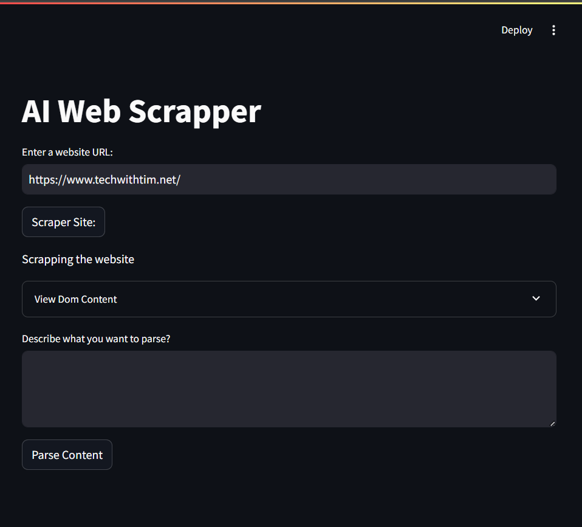

# 🕸️ AI Web Scraper

This is a **Streamlit web application** that uses **AI models** (like **LLaMA 3.2**) to extract specific information from web pages.  
The app takes raw DOM content, processes it, and returns the relevant information based on your input description.

---

## 📥 Step 1: Clone the Repository
Clone the repository to your local machine using:  
```bash
git clone https://github.com/KrishnaGupta0405/AiWebScrapper.git
cd AiWebScrapper
```
- Now time to open our file in the virtual environment

## ✅ Step 2: Activate the Virtual Environment
Now, activate the virtual environment according to your operating system:  

| **Platform**     | **Command to Activate Virtual Environment**         |
|-----------------|----------------------------------------------------|
| 🟢 **Windows**    | ```.\a\Scripts\activate```                |
| 🍎 **MacOS**     | ```source a/bin/activate```             |
| 🐧 **Linux/Unix** | ```source a/bin/activate```             |

Just in-case you make your mind to deactivate the virtual environment run this command-> 
```shell
deactivate
```

## 📦 Step 3: Install Dependencies
Now, install all the required dependencies from the requirements.txt file:
```shell
pip install -r requirements.txt
```
## ▶️ Step 4: Run the Streamlit App
```shell
streamlit run main.py
```
*Note -> In case, streamlit say can find the file or anythin just copy and paste this command->

```shell
# Deletes the virtual environment (if it exists)
Remove-Item -Recurse -Force ai

# Recreate the virtual environment
python -m venv ai

# Activate the virtual environment
.\ai\Scripts\Activate

# Upgrade necessary tools
pip install --upgrade pip setuptools

# Install dependencies from requirements.txt
pip install -r requirements.txt

#Run the Streamlit App
streamlit run main.py
```
---

Images of the actual project->



--

## Requirements (For browser) 🌐
Click the link to download the driver for your browser to help Selenium interact with the internet through your respective browser: [STABLE](https://googlechromelabs.github.io/chrome-for-testing/#stable)

**Note- **Driver version should match the browser version, hence do update your browser

- For Windows 64x [Chrome Driver - win64](https://storage.googleapis.com/chrome-for-testing-public/134.0.6998.88/win64/chromedriver-win64.zip)

After extracting the .zip, copy the driver file to the main directory of your folder.

## Install Ollama 

Download Ollama for Windows from the [Official Website](https://ollama.com/download/windows) and then download the appropriate model from [Ollama](https://github.com/ollama/ollama)

```shell
ollama pull llama3.1 
ollama run llama3.1
```

- You can check if ollama is installed in you device
```shell
ollama
```

- To get a list of installed Ollama models
```shell
ollama list
```
- To remove a model
```shell
ollama rm llama3.1 
```
- *Optional: to remove all the Ollama models*
```shell
ollama prune
```

---
# Steps that i followed for making this project

### Step 1. Create the virtual Environment 🛠️
```shell
python -m venv ai
```
if on UNIX, replace `python` with `python3`

### Step 2. Activate the virtual Environment 🚀

- Command for Command Prompt (CMD)
```shell
.\A\Scripts\activate.bat
```
- Command for PowerShell
```shell
.\A\Scripts\Activate.ps1
```
if on UNIX, replace `ai\Scripts\activate` with `ai/bin/activate`

After this command, you will see prefix `(ai)` before your command line, in the terminal, same as the name of your virtual environment

### Step 3. Install the required libraries 📦
```shell
pip install -r requirements.txt
```

### To run a particular file 🏃‍♂️
```shell
streamlit run main.py
```

### Summary

1. Create a very simple Streamlit user interface (helps to make Python web interface)

2. Grab data from the internet that we want to scrape (e.g., Selenium (Good at scraping web with heavy JS), BeautifulSoup)

   *Selenium allows us to automate a web browser so we can actually navigate to a webpage*

3. After filtering the content, pass it into the LLM like Ollama3.2:8B, or ChatGPT

4. And yeah that's it !!
